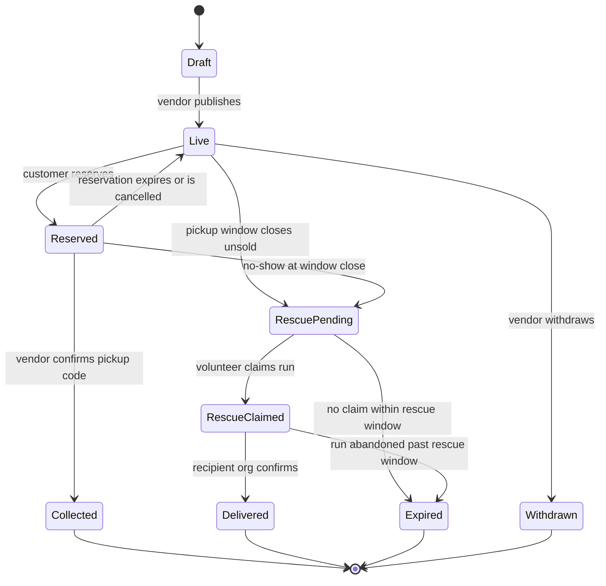

# SRS — Surplus Food Rescue Web App (Islamabad)

Sep 26, 2026 · @team3

## 1. Introduction

### 1.1 Purpose

This SRS defines version 1.0 of a web app that lets Islamabad cafés and bakeries sell end-of-day surplus as discounted "surprise bags" and routes unsold bags to a volunteer rescue network. It is the reference for design, build, test and acceptance.

### 1.2 Problem

Pakistan wastes about 36 million tons of food a year, close to 40% of production ([Dawn](https://www.dawn.com/news/1264699)). One five-star hotel in Islamabad discards 870 kg of food a day ([The News](https://www.thenews.com.pk/print/896287-36m-tonne-food-is-wasted-every-year-in-country)). Rawalpindi's restaurants are estimated to produce about 600 tons of food waste a day (source to be confirmed). Café and bakery surplus in Islamabad is untracked.

### 1.3 Scope

In scope for v1.0:

- A mobile-first progressive web app (PWA), installable on Android Chrome, also usable on desktop and iOS Safari.
- Vendors post surprise bags with a flat price, quantity and pickup window.
- Customers find nearby bags, reserve, pay at pickup or online, and get push alerts on new drops.
- Unsold bags pass to a volunteer network (mosques, universities, CBOs) that collects and delivers them to recipient organisations.
- An admin console for vetting vendors, volunteers and recipient organisations.

Out of scope for v1.0: native Android/iOS apps, delivery to customers, cities other than Islamabad and Rawalpindi, any government system integration.

### 1.4 Definitions

| Term | Meaning |
| --- | --- |
| Surprise bag | A bundle of unsold items at a flat price; contents not listed item by item |
| Drop | A vendor publishing bags for one pickup window |
| Pickup window | The time range when customers may collect a reserved bag |
| Rescue | Volunteer collection of bags still unsold when the window closes |
| Hub | A mosque, university society or CBO that coordinates volunteers |
| Recipient org | A shelter, madrassa, orphanage or community kitchen that receives rescued food |
| PWA | Web app installable to the home screen, with offline cache and web push |
| PKR | Pakistani rupee; all prices are in PKR |

## 2. Overall description

### 2.1 Product perspective

The app is a standalone two-sided marketplace with a donation fallback. It runs peer to peer between vendors, customers and volunteers, with no government infrastructure. The model follows Too Good To Go for sales and foodsharing.de for rescue.

### 2.2 User classes

| Role | Who | Main goals | Device assumption |
| --- | --- | --- | --- |
| Customer | Students, office workers, families | Find cheap food nearby, reserve, collect | Low- to mid-range Android phone, 4G |
| Vendor | Café and bakery owners or staff | Post a drop in under 60 seconds, recover ingredient cost | Shared shop phone or tablet |
| Volunteer | Students, mosque congregants, CBO members | Claim a rescue run, collect, deliver, log it | Android phone, often on mobile data |
| Hub coordinator | Mosque committee, university society, CBO lead | Vet volunteers, see runs in their area | Phone or laptop |
| Recipient org | Shelters, madrassas, orphanages, community kitchens | Receive food, confirm delivery | Phone, sometimes shared |
| Admin | Platform team | Approve accounts, handle reports, see metrics | Laptop |

### 2.3 Operating environment

- Client: PWA on Android Chrome 110+ (primary), iOS Safari 16.4+ (web push needs the app added to the home screen), and current desktop browsers.
- Network: must stay usable on slow 3G and patchy 4G, with offline read of a user's own reservations and runs.
- Server: cloud-hosted, HTTPS only, region nearest Pakistan.

### 2.4 Constraints

- Urdu (right to left) and English UI from day one.
- Payments: cash at pickup must work; online payment via JazzCash or Easypaisa is phase 2.
- Location depends on the phone's GPS or a typed area, since street addresses in Islamabad sectors (e.g. F-7/2) are informal.
- No new third-party service is added without owner approval.

### 2.5 Assumptions and dependencies

- Vendors will price a bag at roughly 30–50% of retail, enough to cover ingredient cost.
- Hubs will supply and vouch for volunteers.
- A map provider (OpenStreetMap-based or Google Maps) and a web push service are available.
- SMS OTP provider coverage for Pakistani numbers (Jazz, Zong, Telenor, Ufone).

## 3. Functional requirements

Priority uses MoSCoW: M = must (v1.0), S = should (v1.0 if time allows), C = could (later).

### 3.1 Bag lifecycle

Every bag moves through one set of states. The rules below refer to them.

### 3.2 Accounts and onboarding

| ID | Requirement | Priority |
| --- | --- | --- |
| FR-1 | Users sign up with a Pakistani mobile number (+92) verified by SMS OTP; email is optional. | M |
| FR-2 | A user picks one role at signup (customer, vendor, volunteer, recipient org) and may add roles later. | M |
| FR-3 | Vendor accounts stay pending until an admin approves business name, address, map pin and a shop photo. | M |
| FR-4 | Volunteer accounts stay pending until a hub coordinator vouches for them. | M |
| FR-5 | Recipient org accounts stay pending until an admin approves name, address, contact person and daily capacity (people served). | M |
| FR-6 | Users can switch UI language between Urdu and English at any time. | M |
| FR-7 | Users can delete their account and personal data from settings. | M |
| FR-8 | OTP requests are limited to 3 per number per 15 minutes. | M |

### 3.3 Vendor: posting drops

| ID | Requirement | Priority |
| --- | --- | --- |
| FR-10 | A vendor creates a drop with: bag type (bakery, café meal, mixed), number of bags, flat price (PKR), estimated retail value, pickup window, and dietary tags (veg, contains nuts, contains egg, etc.). | M |
| FR-11 | The system rejects a price above 60% of the stated retail value, and a pickup window shorter than 30 minutes or starting in the past. | M |
| FR-12 | A vendor can save a drop as a template and republish it in one tap. | M |
| FR-13 | A vendor can set a recurring drop (e.g. daily 9–10 pm) that auto-publishes unless skipped. | S |
| FR-14 | A vendor can reduce bag count or withdraw a drop; affected customers are notified and any online payment is refunded. | M |
| FR-15 | A vendor sees today's reservations with customer first name and pickup code. | M |
| FR-16 | A vendor confirms pickup by entering the customer's 4-digit code or scanning its QR. | M |
| FR-17 | A vendor can mark a drop "donate only" to skip sales and go straight to rescue. | S |
| FR-18 | A vendor dashboard shows bags sold, bags rescued, PKR recovered and kg saved per week. | S |

### 3.4 Customer: discovery, alerts, reservation

| ID | Requirement | Priority |
| --- | --- | --- |
| FR-20 | Customers see live drops as a list and a map, sorted by distance, filterable by bag type, price, dietary tag and pickup time. | M |
| FR-21 | Location comes from device GPS or a chosen sector/area; the default radius is 3 km, adjustable 1–10 km. | M |
| FR-22 | Customers can favourite vendors. | M |
| FR-23 | Customers get a web push alert when a favourite vendor drops, or any drop appears within their radius, subject to quiet hours and a limit of 5 alerts per day. | M |
| FR-24 | Reserving decrements the bag count atomically; two customers can never reserve the last bag. | M |
| FR-25 | A customer may hold at most 2 active reservations. | M |
| FR-26 | A reservation produces a 4-digit pickup code and QR, shown offline. | M |
| FR-27 | Customers can cancel free of charge until 60 minutes before the window starts. | M |
| FR-28 | 3 no-shows in 30 days suspends reserving for 7 days. | M |
| FR-29 | After pickup, customers can rate the bag 1–5 and flag a food safety problem. | M |
| FR-30 | Customers can pay online via JazzCash or Easypaisa at reservation. | C |

### 3.5 Volunteer rescue network

| ID | Requirement | Priority |
| --- | --- | --- |
| FR-40 | When a pickup window closes, unsold and no-show bags become a rescue job for that vendor. | M |
| FR-41 | Rescue jobs are offered first to volunteers of the vendor's linked hub, then to all approved volunteers within 5 km after 15 minutes. | M |
| FR-42 | The system suggests a recipient org by distance and remaining daily capacity; the volunteer can choose another. | M |
| FR-43 | One volunteer claims a job at a time; claims are atomic. | M |
| FR-44 | A volunteer must collect within 60 minutes of claiming, or the job is released back. | M |
| FR-45 | Collection is confirmed by the vendor entering the volunteer's code; delivery is confirmed by the recipient org entering a code. | M |
| FR-46 | Volunteers log estimated weight (kg) at collection. | M |
| FR-47 | Hub coordinators see all jobs and volunteers in their hub and can reassign a stuck job. | M |
| FR-48 | Vendors can pre-schedule a standing rescue (e.g. nightly with a named hub). | S |
| FR-49 | Volunteers see a personal history and totals (runs, kg). | S |

### 3.6 Admin and moderation

| ID | Requirement | Priority |
| --- | --- | --- |
| FR-60 | Admins approve, reject or suspend vendors, recipient orgs and hubs, with a logged reason. | M |
| FR-61 | Admins review food safety flags; 2 confirmed flags in 30 days auto-suspends a vendor pending review. | M |
| FR-62 | Admins see platform metrics: bags sold, bags rescued, bags expired, kg saved, active users, by day and sector. | M |
| FR-63 | Every admin action is recorded in an audit log. | M |

### 3.7 Notifications

| Event | Recipient | Channel |
| --- | --- | --- |
| New drop (favourite or nearby) | Customer | Web push |
| Reservation confirmed, window starting in 30 min | Customer | Web push |
| Drop withdrawn or reduced | Affected customers | Web push + in-app |
| New reservation | Vendor | In-app sound + push |
| Rescue job available | Volunteers (hub first) | Web push |
| Rescue claimed, collected, delivered | Vendor, recipient org, hub | In-app |
| Account approved or rejected | Applicant | SMS + in-app |

If web push is not granted or not supported, the app falls back to in-app notices; SMS fallback for rescue jobs is a C.

## 4. Non-functional requirements

| ID | Area | Requirement |
| --- | --- | --- |
| NFR-1 | Performance | First load under 3 s on a mid-range Android over simulated slow 4G; repeat loads under 1.5 s from cache. |
| NFR-2 | Performance | Initial JS bundle 200 KB gzipped or less; images served as WebP, max 100 KB each. |
| NFR-3 | Performance | Drop list and reserve API respond in under 500 ms at p95. |
| NFR-4 | Performance | Push alert reaches devices within 60 s of a drop being published. |
| NFR-5 | Capacity | Handles 500 vendors, 20,000 customers and 1,000 concurrent users at the 8–10 pm peak. |
| NFR-6 | Offline | Own reservations, pickup codes and claimed rescue jobs readable offline. |
| NFR-7 | Availability | 99.5% monthly uptime, with 6–11 pm PKT treated as the critical window for deploys (no deploys then). |
| NFR-8 | Security | HTTPS only with HSTS; CSP, X-Frame-Options, X-Content-Type-Options headers set. |
| NFR-9 | Security | All input validated server-side; parameterised queries only; output escaped against XSS. |
| NFR-10 | Security | Rate limits on every public endpoint (e.g. 60 requests/min per user, stricter on OTP and reserve). |
| NFR-11 | Security | Role-based access: a user can only act on their own drops, reservations and jobs; admin actions need admin role. |
| NFR-12 | Security | Errors return generic messages; no stack traces or internals in responses. |
| NFR-13 | Privacy | Phone numbers never shown to other users; vendors see first name only; volunteers see recipient org address only after claiming. |
| NFR-14 | Privacy | Precise user location is not stored; only the chosen area or a rounded point. Complies with Pakistan's data protection law once enacted. |
| NFR-15 | Data integrity | Reservations and rescue claims use transactions or optimistic locking so bag counts never go negative. |
| NFR-16 | Localisation | Full Urdu (RTL) and English; PKR formatting; times in PKT (UTC+5), 12-hour clock. |
| NFR-17 | Accessibility | WCAG 2.1 AA: 4.5:1 contrast, 44 px tap targets, screen-reader labels, works at 200% text size. |
| NFR-18 | Observability | Structured logs with timestamp, request ID and user ID; error alerting to the team. |
| NFR-19 | Maintainability | Automated test suite covering all M requirements, including error and edge cases, run in CI on every change. |
| NFR-20 | Scalability | Stateless API; list endpoints paginated; indexes on foreign keys, location and drop time. |

## 5. Data model and external interfaces

### 5.1 Core entities

| Entity | Key fields | Relations |
| --- | --- | --- |
| User | id, phone (unique), name, language, roles[], status, created_at | has one Vendor / Volunteer / RecipientOrg profile per role |
| Vendor | id, user_id, business_name, address, location (lat/lng), sector, photo, status, hub_id | has many Drops |
| Drop | id, vendor_id, bag_type, price_pkr, retail_value_pkr, bag_count, bags_left, window_start, window_end, dietary_tags[], status, version | has many Reservations, zero or one RescueJob |
| Reservation | id, drop_id, customer_id, pickup_code, status, payment_method, created_at | belongs to Drop and User |
| Hub | id, name, type (mosque, university, CBO), area, coordinator_id, status | has many Volunteers |
| Volunteer | id, user_id, hub_id, vouched_by, status | claims RescueJobs |
| RecipientOrg | id, user_id, name, address, location, daily_capacity, status | receives RescueJobs |
| RescueJob | id, drop_id, bag_count, volunteer_id, recipient_org_id, weight_kg, status, claimed_at, collected_at, delivered_at, version | belongs to Drop |
| Rating | id, reservation_id, stars, safety_flag, comment | belongs to Reservation |
| PushSubscription | id, user_id, endpoint, keys, radius_km, quiet_hours | belongs to User |
| AuditLog | id, actor_id, action, target, reason, at | — |

`version` columns support optimistic locking on the contested writes (FR-24, FR-43).

### 5.2 External interfaces

| Interface | Use | Notes |
| --- | --- | --- |
| SMS OTP gateway | Sign-in, approval notices | Must deliver to all four Pakistani networks |
| Web Push (VAPID) | Drop and rescue alerts | Native browser standard, no vendor lock-in |
| Maps and geocoding | Map view, distance sort, sector search | OpenStreetMap tiles or Google Maps; choice open |
| JazzCash / Easypaisa | Online payment and refunds | Phase 2 (FR-30) |
| Object storage | Shop and bag photos | Resize on upload |

### 5.3 User interface

- Bottom tab bar per role: Customer (Explore, Map, Reservations, Profile); Vendor (Today, New drop, History, Profile); Volunteer (Jobs, My runs, Profile).
- "New drop" is one screen with sensible defaults from the last drop.
- Pickup codes shown large and high-contrast for quick counter checks.

## 6. Food safety, legal and trust rules

The platform only connects parties; vendors stay responsible for the food they hand over. The rules below keep risk low and trust high.

| ID | Rule | Priority |
| --- | --- | --- |
| FS-1 | Vendors accept terms at signup: food must be safe to eat, prepared that day or within its shelf life, and stored correctly until pickup. | M |
| FS-2 | Allowed at launch: baked goods, sandwiches, packaged items, cooked café food kept hot or chilled. Not allowed: raw meat, raw seafood, opened dairy past date, anything already served to a customer. | M |
| FS-3 | Drops must carry allergen tags; "may contain nuts/egg/gluten" is the default until the vendor clears it. | M |
| FS-4 | Rescue windows are short: cooked food must reach a recipient org within 3 hours of the pickup window closing, or the job expires. | M |
| FS-5 | Every bag and rescued item must be halal; vendors confirm this at signup. | M |
| FS-6 | Recipient orgs confirm on delivery that food looked and smelled fine, or reject it with a reason. | M |
| FS-7 | Customers and recipients see a clear notice that contents vary and to check allergens with the vendor. | M |
| FS-8 | Terms of service and a privacy policy in Urdu and English, reviewed by a Pakistani lawyer before launch. | M |
| FS-9 | The platform takes no commission in v1.0; any future fee needs its own terms. | S |

Open legal point: confirm with the Islamabad Capital Territory food regulator whether vendors or the platform need any permit for discounted surplus sales or donations.

## 7. MVP scope, phasing and success metrics

### 7.1 Phases

| Phase | Contents | Exit gate |
| --- | --- | --- |
| 1. Pilot MVP | All M requirements; cash only; 2–3 sectors (e.g. F-6, F-7, Blue Area); 10–15 vendors, 1–2 hubs, 3–5 recipient orgs | 4 weeks running, 70%+ of bags sold or rescued |
| 2. Growth | S requirements, JazzCash/Easypaisa (FR-30), recurring drops, vendor analytics | 50 active vendors |
| 3. Expand | Rawalpindi, restaurants and hotels, SMS fallback, native Android wrapper if PWA limits bite | Unit economics and hub capacity proven |

### 7.2 Success metrics (pilot)

| Metric | Target |
| --- | --- |
| Bags sold / bags posted | 60% or more |
| Unsold bags rescued | 80% or more of the remainder |
| Bags expired (wasted) | 10% or less |
| Food saved | 1,000 kg in the first 4 weeks |
| Vendor retention | 70% still posting weekly after 4 weeks |
| Customer no-show rate | 10% or less |
| Median time from rescue job to claim | 20 minutes or less |

### 7.3 Acceptance

v1.0 is accepted when every M requirement has passing automated tests (including failure paths such as double-reserve, expired OTP, abandoned rescue) and a pilot walkthrough is completed on a mid-range Android phone in Urdu and English.

### 7.4 Open questions

- [ ] Web app only, or is an Android app (the original idea) still the goal? This SRS assumes an installable PWA for v1.0.
- [ ] Product name and domain.
- [ ] Map provider: OpenStreetMap (free) or Google Maps (better local data, paid)?
- [ ] Should customers pay a small platform fee, or vendors a commission, to fund operations?
- [ ] Which mosques, universities and CBOs will be the pilot hubs?
- [ ] Source for the Rawalpindi 600 tons/day figure.
- [ ] Permit or registration requirements with the Islamabad food regulator.
- [ ] Volunteer liability and safety: is an ID check needed beyond hub vouching?

## Sources

- [Dawn: 36m tonnes of food wasted yearly](https://www.dawn.com/news/1264699)
- [The News: 36m tonne food is wasted every year in country](https://www.thenews.com.pk/print/896287-36m-tonne-food-is-wasted-every-year-in-country)

Figures are as provided in the product brief; pages not independently re-checked.
